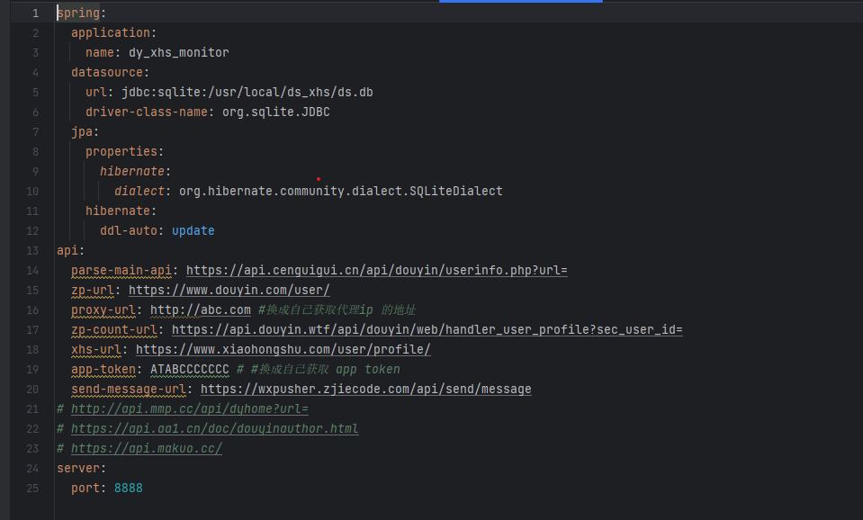

# 如何部署
    特此声明 任何涉及数据注入的操作都是不被允许的，本项目仅供学习交流使用，如有违反，后果自负

    前提 需要安装java maven 打出jar包 安装添加 anpodman 联系作者拿打包好的jar 然后解压替换 自己的配置文件 application-pro.yml
    找一个代理ip网站 获取一个代理ip提取了解 配置在 
  
图片中的 proxy-url  去 https://wxpusher.zjiecode.com/ 注册一个账户 获取自己的 app-token 配置好着两项就可以了  
注意数据库 url: jdbc:sqlite:/usr/local/ds_xhs/ds.db   一定压迫配置自己的地址

使用参考 IndexController 里面的接口
1. 通过 接口 http://localhost:8888/add/monitor/url?url=     添加关注的 斗音和红薯小姐姐 主页地址
2. 通过宝塔的计划任务 调用 http://localhost:8888/exe

1. 感谢star⭐和follow📰！不时更新
2. 作者的联系方式在主页里，有问题可以随时联系我
3. 可以关注下作者的其他项目，欢迎 PR 和 issue
4. 感谢赞助！如果此项目对您有帮助，请作者喝一杯奶茶~~ （开心一整天😊😊） 

